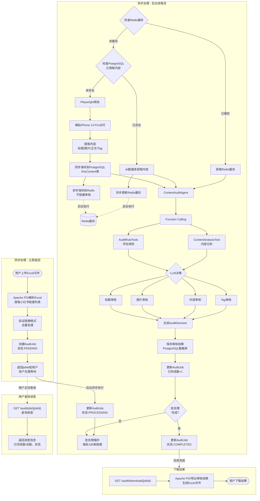
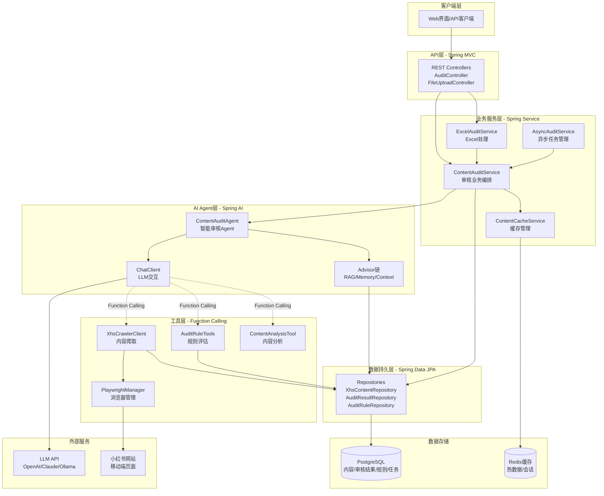

# Java + Spring + Spring AI 小红书审核Agent 实现计划

**日期**：2026年1月27日  
**版本**：1.0  
**状态**：待批准

---

## 概要

使用Spring Boot 3.5.x和Spring AI 1.1构建企业级审核系统。通过Spring AI的ChatClient、Function Calling工具、Advisor链和数据库查询实现多维度智能审核。采用分层架构（Controller-Service-Repository），集成Excel处理、异步任务、数据库持久化等功能。

### 整体流程图



### 技术架构图



---

## 实现步骤

### 1. 初始化Spring Boot项目结构
创建Maven项目，配置pom.xml（Spring Boot 3.5.x、Spring AI 1.1、Apache POI、PostgreSQL驱动、Playwright Java等），设置以下核心包结构：
- `config/` - 配置类（AppConfig、AsyncConfig、SecurityConfig等）
- `controller/` - REST控制器
- `service/` - 业务逻辑层
- `agent/` - Agent审核引擎
- `tool/` - Function Calling工具类
- `repository/` - 数据访问层（Spring Data JPA）
- `model/` - 实体类和DTO
- `exception/` - 异常处理
- `util/` - 工具类

### 2. 配置Spring AI和数据库
- 在 `application.yml` 中配置OpenAI/其他LLM API密钥
- 配置模型参数：temperature、max-tokens、base-url等
- 在 `config/AppConfig.java` 中创建ChatClient Bean
- 配置PostgreSQL数据库连接和Spring Data JPA
- 创建XhsContent实体类，使用JSONB类型存储图片、Tag、评论等半结构化数据
- 配置审核规则和敏感词数据表，使用索引优化查询性能

### 3. 设计并实现审核规则工具
- 在 `tool/AuditRuleTools.java` 中使用 `@Tool` 注解定义Function Calling工具
- 实现以下方法：
  - `getApplicableRules()` - 获取适用审核规则
  - `evaluateRule()` - 评估内容是否违反规则
  - `getSensitiveWords()` - 获取敏感词库
- 规则应支持四个维度：标题、图片、内容、tag

### 4. 开发小红书内容获取工具（Playwright爬虫）
- 在 `tool/XhsCrawlerClient.java` 中使用Playwright实现内容爬取
- **浏览器实例池配置**：
  - 创建**3个浏览器实例**（平衡性能和内存占用）
  - 内存需求：**1-1.5GB**（需要4GB服务器）
  - 每个实例独立运行，支持并发爬虫
  - 使用队列（BlockingQueue）管理实例分配
  - 爬虫线程数配置：3（与浏览器实例数相同）
- **配置Playwright**：
  - 使用iPhone 13 Pro设备配置模拟移动端访问
  - 设置合理的请求延迟（2-5秒随机间隔，防反爬）
  - 配置User-Agent和viewport自动匹配移动设备
  - 启用无头模式（Headless）用于生产环境
  - 设置页面加载超时：30秒
  - 并发爬虫数量：**3个同时爬取**（配合3个浏览器实例）
- **实现以下 `@Tool` 方法**：
  - `getPostContent(url)` - 爬取帖子标题、图片URL列表、正文内容、tag列表
  - `getComments(url)` - 滚动加载并提取评论列表（可选）
  - `getPostMetadata(url)` - 提取发布者昵称、发布时间、点赞数等
- **实现反爬虫对抗**：
  - 随机延迟（避免固定频率请求）
  - 浏览器指纹伪装（隐藏webdriver标识）
  - IP轮换（可选，使用代理池）
  - 单个链接爬虫失败重试3次后放弃
  - 错误重试机制（网络超时、页面加载失败）
  - IP限流检测和降级处理
- **浏览器实例池管理**（在 `config/PlaywrightConfig.java`）：
  - 初始化3个浏览器实例，启动时创建，关闭时释放
  - 使用 `BlockingQueue<Browser>` 管理实例
  - 获取实例超时时间：5秒（超时则放弃该链接，标记失败）
  - 示例代码框架（完整版）：
    ```java
    @Component
    public class PlaywrightManager implements DisposableBean {
      
      private BlockingQueue<BrowserInstance> browserPool;
      private ScheduledExecutorService healthChecker;
      private Playwright playwright;
      private volatile boolean isShuttingDown = false;
      
      // 浏览器实例包装类
      static class BrowserInstance {
        Browser browser;
        AtomicInteger failureCount = new AtomicInteger(0);
        long lastUsedTime;
        Set<String> activePageIds = ConcurrentHashMap.newKeySet(); // 跟踪活跃Page
        
        boolean isHealthy() {
          try {
            browser.contexts().size(); // 健康检查
            return failureCount.get() < 3 && activePageIds.size() < 10; // 限制每Browser最多10个Page
          } catch (Exception e) {
            failureCount.incrementAndGet();
            return false;
          }
        }
        
        void close() {
          try {
            // 1. 关闭所有活跃的Page
            for (Page page : browser.contexts().stream()
                .flatMap(ctx -> ctx.pages().stream())
                .collect(Collectors.toList())) {
              page.close();
            }
            // 2. 关闭所有Context
            for (BrowserContext ctx : browser.contexts()) {
              ctx.close();
            }
            // 3. 关闭浏览器
            browser.close();
          } catch (Exception e) {
            log.error("关闭浏览器实例失败", e);
          }
        }
      }
      
      @PostConstruct
      public void initBrowserPool() {
        playwright = Playwright.create();
        browserPool = new LinkedBlockingQueue<>(3);
        
        for (int i = 0; i < 3; i++) {
          browserPool.offer(createBrowserInstance());
        }
        
        // 启动健康检查（每30秒）
        scheduleHealthCheck();
        
        log.info("浏览器实例池初始化完成: {} 个实例", browserPool.size());
      }
      
      private BrowserInstance createBrowserInstance() {
        BrowserInstance instance = new BrowserInstance();
        instance.browser = playwright.chromium().launch(
          new BrowserType.LaunchOptions()
            .setHeadless(true)
            .setArgs(Arrays.asList(
              "--disable-blink-features=AutomationControlled",
              "--no-sandbox"
            ))
        );
        instance.lastUsedTime = System.currentTimeMillis();
        return instance;
      }
      
      /**
       * 借用浏览器Page（带重试）
       * 使用完毕后必须调用closePage释放资源
       */
      public PageWrapper borrowPage() throws InterruptedException {
        if (isShuttingDown) {
          throw new IllegalStateException("浏览器池正在关闭");
        }
        
        for (int retry = 0; retry < 3; retry++) {
          BrowserInstance instance = browserPool.poll(5, TimeUnit.SECONDS);
          
          if (instance == null) {
            log.warn("浏览器池超时，重试 {}/3", retry + 1);
            continue;
          }
          
          if (!instance.isHealthy()) {
            log.warn("浏览器实例不健康，重建");
            instance.close();
            instance = createBrowserInstance();
          }
          
          try {
            // 创建新的BrowserContext和Page
            BrowserContext context = instance.browser.newContext(
              new Browser.NewContextOptions()
                .setUserAgent("Mozilla/5.0 (iPhone; CPU iPhone OS 15_0 like Mac OS X)")
                .setViewportSize(390, 844) // iPhone 13 Pro
            );
            Page page = context.newPage();
            String pageId = UUID.randomUUID().toString();
            instance.activePageIds.add(pageId);
            instance.lastUsedTime = System.currentTimeMillis();
            
            return new PageWrapper(page, context, instance, pageId);
            
          } catch (Exception e) {
            log.error("创建Page失败", e);
            instance.failureCount.incrementAndGet();
            browserPool.offer(instance); // 返回池
            continue;
          }
        }
        
        throw new BrowserPoolExhaustedException("浏览器池耗尽，重试3次均失败");
      }
      
      /**
       * 关闭Page并归还浏览器实例
       * 必须在finally块中调用
       */
      public void closePage(PageWrapper wrapper) {
        if (wrapper == null) return;
        
        try {
          // 1. 关闭Page
          if (!wrapper.page.isClosed()) {
            wrapper.page.close();
          }
          // 2. 关闭Context
          wrapper.context.close();
          // 3. 从活跃集合中移除
          wrapper.instance.activePageIds.remove(wrapper.pageId);
        } catch (Exception e) {
          log.error("关闭Page失败", e);
        } finally {
          // 4. 归还浏览器实例到池
          if (!isShuttingDown) {
            browserPool.offer(wrapper.instance);
          }
        }
      }
      
      /**
       * 定期健康检查
       */
      private void scheduleHealthCheck() {
        healthChecker = Executors.newSingleThreadScheduledExecutor(
          r -> new Thread(r, "browser-health-checker")
        );
        
        healthChecker.scheduleAtFixedRate(() -> {
          try {
            List<BrowserInstance> instances = new ArrayList<>();
            browserPool.drainTo(instances);
            
            for (BrowserInstance instance : instances) {
              if (instance.isHealthy()) {
                browserPool.offer(instance);
              } else {
                log.warn("检测到不健康的浏览器实例，重建");
                instance.close();
                browserPool.offer(createBrowserInstance());
              }
            }
            
            log.debug("浏览器健康检查完成: {} 个健康实例", browserPool.size());
          } catch (Exception e) {
            log.error("健康检查失败", e);
          }
        }, 30, 30, TimeUnit.SECONDS);
      }
      
      /**
       * Spring容器关闭时的清理逻辑
       */
      @Override
      public void destroy() {
        log.info("开始关闭浏览器实例池...");
        isShuttingDown = true;
        
        // 1. 停止健康检查
        if (healthChecker != null) {
          healthChecker.shutdown();
          try {
            healthChecker.awaitTermination(5, TimeUnit.SECONDS);
          } catch (InterruptedException e) {
            healthChecker.shutdownNow();
          }
        }
        
        // 2. 关闭所有浏览器实例
        List<BrowserInstance> instances = new ArrayList<>();
        browserPool.drainTo(instances);
        for (BrowserInstance instance : instances) {
          instance.close();
        }
        
        // 3. 关闭Playwright
        if (playwright != null) {
          playwright.close();
        }
        
        log.info("浏览器实例池已关闭");
      }
      
      /**
       * Page包装类，确保资源正确释放
       */
      public static class PageWrapper implements AutoCloseable {
        public final Page page;
        public final BrowserContext context;
        private final BrowserInstance instance;
        private final String pageId;
        
        PageWrapper(Page page, BrowserContext context, BrowserInstance instance, String pageId) {
          this.page = page;
          this.context = context;
          this.instance = instance;
          this.pageId = pageId;
        }
        
        @Override
        public void close() {
          // 由PlaywrightManager.closePage处理
          // 这里不做实际关闭，避免重复关闭
        }
      }
    }
    ```
  
  - **使用示例**（在CrawlerService中）：
    ```java
    @Service
    public class CrawlerService {
      
      @Autowired
      private PlaywrightManager playwrightManager;
      
      public XhsContent crawlContent(String url) {
        PlaywrightManager.PageWrapper wrapper = null;
        try {
          // 1. 借用Page（会自动重试）
          wrapper = playwrightManager.borrowPage();
          Page page = wrapper.page;
          
          // 2. 设置超时
          page.setDefaultTimeout(30000); // 30秒
          
          // 3. 访问页面
          page.navigate(url);
          page.waitForLoadState(LoadState.NETWORKIDLE);
          
          // 4. 提取内容
          String title = page.title();
          String content = page.locator(".note-content").textContent();
          // ...
          
          return XhsContent.builder()
            .title(title)
            .content(content)
            .build();
            
        } catch (TimeoutException e) {
          log.error("爬虫超时: {}", url);
          throw new CrawlerTimeoutException(url);
        } catch (Exception e) {
          log.error("爬虫失败: {}", url, e);
          throw new CrawlerException(url, e);
        } finally {
          // 5. 必须关闭Page并归还浏览器实例（防止内存泄漏）
          playwrightManager.closePage(wrapper);
        }
      }
      
      // 或者使用try-with-resources（Java 7+）
      public XhsContent crawlContentV2(String url) {
        try (PlaywrightManager.PageWrapper wrapper = playwrightManager.borrowPage()) {
          Page page = wrapper.page;
          // ... 爬虫逻辑
          return content;
        } // 自动调用close()
      }
    }
    ```
- 在 `service/ContentStorageService.java` 中实现内容存储：
  - **优先同步保存到Redis**（1-5ms，快速缓存）
  - **异步保存到PostgreSQL**（50-100ms，持久化存储，使用@Async）
  - 爬取前先检查Redis缓存，Redis miss时再检查PostgreSQL，最后才触发爬虫
  - 从DB查询到数据后，立即回填Redis缓存（保持热数据）

### 5. 构建Agent审核引擎
- 在 `agent/ContentAuditAgent.java` 中实现审核Agent
- **Agent核心设计**：
  - 使用ChatClient + Function Calling实现多轮对话式审核
  - LLM作为决策中心，调用工具进行规则评估和内容分析
  - 所有规则数据直接从PostgreSQL数据库查询（不使用RAG）
  - 返回结构化的 `AuditDecision` 对象

- **System Prompt设计**（系统角色定义）：
  ```
  你是一个小红书内容审核专家。你的职责是评估用户上传的小红书帖子是否合规。
  
  审核维度（按优先级）：
  1. 标题审核 - 检查标题长度、敏感词、违规表述
  2. 内容审核 - 检查正文中的敏感词、政治敏感、虚假宣传
  3. Tag审核 - 检查标签合规性、是否过度标签堆砌
  4. 图片审核 - 检查图片数量、URL有效性
  
  请按照以下步骤审核：
  1. 调用 getAuditRules 获取所有审核规则
  2. 调用 checkSensitiveWords 检查敏感词
  3. 调用 analyzeContent 进行内容深度分析
  4. 综合判断，生成最终决策
  
  决策结果应包含：
  - status: PASSED / REJECTED / UNCERTAIN
  - reasons: 驳回原因数组（每个原因包含维度和具体原因）
  - confidenceScore: 0-1的置信度
  - suggestedAction: 建议处理方式
  ```

- **Advisor链配置**（简化）：
  - `MessageChatMemoryAdvisor` - 维护审核对话历史（便于后续追踪审核过程）
  - 自定义 `ContextEnhancementAdvisor` - 补充发布者信息、历史审核记录等上下文

- **Function Calling工具**（Agent可调用）：
  1. `getAuditRules(dimension: String)` - 从数据库查询某维度的所有审核规则
  2. `checkSensitiveWords(text: String)` - 检查文本中的敏感词
  3. `analyzeContent(title, content, tags)` - 进行内容深度分析

- **审核流程**（Agent执行）：
  ```
  输入：XhsContent对象（标题、图片URL、正文、tag）
  
  步骤1：Agent收到System Prompt，调用 getAuditRules("all") 获取所有规则
  步骤2：Agent循环调用 checkSensitiveWords(标题/正文/tag)
  步骤3：Agent调用 analyzeContent 进行LLM深度分析
  步骤4：LLM综合所有检查结果，生成决策
  步骤5：如果置信度 < 0.7，Agent可再次调用工具进行补充检查
  步骤6：生成最终 AuditDecision 对象，返回结果
  
  输出：AuditDecision {
    status: "PASSED" | "REJECTED" | "UNCERTAIN",
    reasons: [{dimension: "title", reason: "包含敏感词'XXX'"}],
    confidenceScore: 0.95,
    suggestedAction: "驳回"
  }
  ```

#### 5.1 Agent详细设计

**类结构设计**：

```java
@Component
public class ContentAuditAgent {
    
    private final ChatClient chatClient;
    private final AuditRuleRepository auditRuleRepository;
    private final SensitiveWordRepository sensitiveWordRepository;
    private final StructuredOutputConverter<AuditDecision> outputConverter;
    
    @Autowired
    public ContentAuditAgent(
        ChatClient.Builder chatClientBuilder,
        AuditRuleRepository auditRuleRepository,
        SensitiveWordRepository sensitiveWordRepository) {
        
        // 创建结构化输出转换器
        this.outputConverter = new BeanOutputConverter<>(AuditDecision.class);
        
        // 构建ChatClient，注册Function Calling工具
        this.chatClient = chatClientBuilder
            .defaultSystem(buildSystemPrompt())
            .defaultFunctions("getAuditRules", "checkSensitiveWords", "analyzeContent")
            .defaultAdvisors(
                new MessageChatMemoryAdvisor(new InMemoryChatMemory()),
                new ContextEnhancementAdvisor()
            )
            .build();
        
        this.auditRuleRepository = auditRuleRepository;
        this.sensitiveWordRepository = sensitiveWordRepository;
    }
    
    // 主入口：审核单个内容
    public AuditDecision auditContent(XhsContent content) {
        // 详细实现见下文
    }
    
    // Function Calling工具实现
    @Bean
    public FunctionCallback getAuditRulesFunction() { /* ... */ }
    
    @Bean
    public FunctionCallback checkSensitiveWordsFunction() { /* ... */ }
    
    @Bean
    public FunctionCallback analyzeContentFunction() { /* ... */ }
}
```

**核心方法实现**：

```java
/**
 * 审核内容主方法
 * @param content 爬取的小红书内容
 * @return 审核决策对象
 */
public AuditDecision auditContent(XhsContent content) {
    try {
        // 1. 构建用户消息（输入给LLM的内容）
        String userMessage = buildUserMessage(content);
        
        // 2. 调用ChatClient，使用StructuredOutputConverter确保输出格式
        AuditDecision decision = chatClient.prompt()
            .user(userMessage)
            .user(u -> u.param("format", outputConverter.getFormat()))
            .call()
            .entity(outputConverter);
        
        // 3. 补充元数据
        decision.setPostId(content.getPostId());
        decision.setUrl(content.getUrl());
        decision.setAuditedTime(LocalDateTime.now());
        
        return decision;
        
    } catch (Exception e) {
        log.error("审核失败: postId={}, error={}", content.getPostId(), e.getMessage(), e);
        // 返回默认决策（UNCERTAIN）
        return AuditDecision.uncertain(content.getPostId(), 
            "审核异常：" + e.getMessage());
    }
}

/**
 * 构建用户消息（发送给LLM）
 */
private String buildUserMessage(XhsContent content) {
    return String.format("""
        请审核以下小红书帖子：
        
        【帖子ID】%s
        【标题】%s
        【内容】%s
        【标签】%s
        【图片数量】%d
        【图片链接】%s
        【发布者ID】%s
        【发布时间】%s
        
        请严格按照System Prompt中的步骤进行审核，返回JSON格式决策。
        """,
        content.getPostId(),
        content.getTitle(),
        content.getContent(),
        content.getTags(),
        content.getImages() != null ? content.getImages().size() : 0,
        content.getImages(),
        content.getAuthorId(),
        content.getPublishedAt()
    );
}

```

**Function Calling工具实现**：

```java
/**
 * 工具1：获取审核规则
 * LLM调用示例：getAuditRules("title") 或 getAuditRules("all")
 */
@Bean
@Description("从数据库获取指定维度的审核规则，用于评估内容是否合规")
public Function<GetAuditRulesRequest, List<AuditRule>> getAuditRules() {
    return request -> {
        String dimension = request.dimension();
        
        List<AuditRule> rules;
        if ("all".equalsIgnoreCase(dimension)) {
            // 获取所有启用的规则，按优先级排序
            rules = auditRuleRepository.findByEnabledTrueOrderByPriorityDesc();
        } else {
            // 获取指定维度的规则
            rules = auditRuleRepository.findByDimensionAndEnabledTrue(dimension);
        }
        
        log.info("获取审核规则: dimension={}, count={}", dimension, rules.size());
        return rules;
    };
}

record GetAuditRulesRequest(
    @JsonProperty(required = true) 
    @JsonPropertyDescription("审核维度：title/content/tag/image/all") 
    String dimension
) {}

/**
 * 工具2：检查敏感词
 * LLM调用示例：checkSensitiveWords("这是一个包含敏感词的文本")
 */
@Bean
@Description("检查文本中是否包含敏感词，返回匹配的敏感词列表及其严重程度")
public Function<CheckSensitiveWordsRequest, SensitiveWordResult> checkSensitiveWords() {
    return request -> {
        String text = request.text();
        
        // 1. 从缓存获取敏感词匹配器（启动时初始化，10分钟TTL）
        SensitiveWordMatcher matcher = getSensitiveWordMatcher();
        
        // 2. 使用AC自动机高效匹配（时间复杂度O(n)，n为文本长度）
        // 推荐使用开源库：sensitive-word-filter 或 ToolGood.Words
        List<SensitiveWordMatch> matches = matcher.findAll(text);
        
        // 性能对比：
        // 原方案contains：5000词 × 1000字 = 5,000,000次比较 ≈ 50ms
        // AC自动机：1000字 + 10个匹配 ≈ 0.5ms（提升100倍）
        
        // 3. 返回结果
        boolean hasSensitiveWords = !matches.isEmpty();
        String highestSeverity = matches.stream()
            .map(SensitiveWordMatch::severity)
            .max(Comparator.comparing(this::severityToInt))
            .orElse("LOW");
        
        log.info("敏感词检查: text={}, found={}, matches={}", 
            text.substring(0, Math.min(50, text.length())), 
            hasSensitiveWords, 
            matches.size());
        
        return new SensitiveWordResult(hasSensitiveWords, matches, highestSeverity);
    };
}

record CheckSensitiveWordsRequest(
    @JsonProperty(required = true) 
    @JsonPropertyDescription("要检查的文本内容") 
    String text
) {}

record SensitiveWordMatch(String word, String category, String severity) {}
record SensitiveWordResult(boolean found, List<SensitiveWordMatch> matches, String severity) {}

/**
 * 工具3：内容深度分析
 * LLM调用示例：analyzeContent("标题", "正文", ["标签1", "标签2"])
 */
@Bean
@Description("对内容进行深度语义分析，识别隐含违规、情感倾向、主题分类等")
public Function<AnalyzeContentRequest, ContentAnalysisResult> analyzeContent() {
    return request -> {
        // 此工具可选地调用另一个LLM进行深度分析
        // 或使用规则引擎进行复杂逻辑判断
        
        String title = request.title();
        String content = request.content();
        List<String> tags = request.tags();
        
        // 示例：使用LLM进行深度分析
        String analysisPrompt = String.format("""
            请分析以下内容，识别潜在问题：
            标题：%s
            内容：%s
            标签：%s
            
            分析维度：
            1. 是否存在隐性营销
            2. 是否存在虚假宣传
            3. 是否存在诱导点击
            4. 情感倾向（正面/中性/负面）
            5. 主题分类
            
            返回JSON格式：{
              "hasImplicitMarketing": true/false,
              "hasFalseAdvertising": true/false,
              "hasClickbait": true/false,
              "sentiment": "positive/neutral/negative",
              "topics": ["话题1", "话题2"],
              "riskScore": 0-100,
              "details": "详细分析说明"
            }
            """, title, content, tags);
        
        // 调用LLM（这里简化处理，实际可复用chatClient）
        ChatResponse response = chatClient.prompt()
            .user(analysisPrompt)
            .call()
            .chatResponse();
        
        String resultJson = response.getResult().getOutput().getContent();
        
        log.info("内容深度分析完成: title={}", title);
        
        return parseContentAnalysisResult(resultJson);
    };
}

record AnalyzeContentRequest(
    @JsonProperty(required = true) String title,
    @JsonProperty(required = true) String content,
    List<String> tags
) {}

record ContentAnalysisResult(
    boolean hasImplicitMarketing,
    boolean hasFalseAdvertising,
    boolean hasClickbait,
    String sentiment,
    List<String> topics,
    int riskScore,
    String details
) {}
```

**System Prompt构建**：

```java
private String buildSystemPrompt() {
    return """
        你是一个小红书内容审核专家。你的职责是评估用户上传的小红书帖子是否合规。
        
        【审核维度】（按优先级）：
        1. 标题审核 - 检查标题长度、敏感词、违规表述、诱导点击
        2. 内容审核 - 检查正文中的敏感词、政治敏感、虚假宣传、隐性营销
        3. Tag审核 - 检查标签合规性、是否过度标签堆砌、是否偏离主题
        4. 图片审核 - 检查图片数量、URL有效性（如启用Vision，调用validateImageContent）
        
        【可用工具】：
        1. getAuditRules(dimension) - 获取审核规则，dimension可选值：title/content/tag/image/all
        2. checkSensitiveWords(text) - 检查文本中的敏感词
        3. analyzeContent(title, content, tags) - 进行内容深度语义分析
        4. validateImageContent(imageUrl, contextText) - [可选] 验证图片与文案匹配（需启用Vision）
        
        【审核步骤】：
        第1步：调用 getAuditRules("all") 获取所有审核规则
        第2步：依次对标题、内容、标签调用 checkSensitiveWords 检查敏感词
        第3步：调用 analyzeContent 进行深度语义分析，识别隐性违规
        第4步：根据规则和工具返回结果，综合判断内容是否合规
        第5步：如果置信度 < 0.7，可再次调用工具补充检查，或标记为UNCERTAIN
        第6步：生成最终决策，必须返回JSON格式
        
        【决策标准】：
        - PASSED（通过）: 所有维度均无违规，置信度 >= 0.8
        - REJECTED（驳回）: 至少一个维度存在明确违规
        - UNCERTAIN（不确定）: 置信度 < 0.7，或需要人工复核
        
        【输出格式】：
        {format}
        
        【注意事项】：
        1. 必须调用工具获取数据，不要凭空猜测
        2. 敏感词匹配必须准确，避免误判
        3. 对于边界case，宁可标记UNCERTAIN交由人工
        4. 严格按照输出格式返回结果
        """;
}
```

**Advisor自定义实现**：

```java
/**
 * 上下文增强Advisor - 补充发布者历史、审核记录等上下文
 */
public class ContextEnhancementAdvisor implements CallAroundAdvisor {
    
    private final XhsContentRepository contentRepository;
    private final AuditResultRepository auditResultRepository;
    
    @Override
    public AdvisedResponse aroundCall(AdvisedRequest advisedRequest, CallAroundAdvisorChain chain) {
        
        // 从用户消息中提取postId（简化处理）
        String userMessage = advisedRequest.userText();
        String postId = extractPostId(userMessage);
        
        if (postId != null) {
            // 1. 获取发布者的历史内容
            XhsContent currentContent = contentRepository.findByPostId(postId).orElse(null);
            if (currentContent != null && currentContent.getAuthorId() != null) {
                List<XhsContent> authorHistory = contentRepository
                    .findByAuthorIdOrderByPublishedAtDesc(currentContent.getAuthorId())
                    .stream()
                    .limit(5)
                    .toList();
                
                // 2. 获取该发布者的历史审核记录
                List<AuditResult> auditHistory = auditResultRepository
                    .findByAuthorIdOrderByAuditedAtDesc(currentContent.getAuthorId())
                    .stream()
                    .limit(10)
                    .toList();
                
                // 3. 构建上下文信息
                String contextInfo = buildContextInfo(authorHistory, auditHistory);
                
                // 4. 将上下文信息添加到System Message
                Map<String, Object> context = new HashMap<>(advisedRequest.adviseContext());
                context.put("authorContext", contextInfo);
                
                advisedRequest = AdvisedRequest.from(advisedRequest)
                    .withAdviseContext(context)
                    .build();
            }
        }
        
        // 继续执行链
        return chain.nextAroundCall(advisedRequest);
    }
    
    private String buildContextInfo(List<XhsContent> history, List<AuditResult> auditHistory) {
        long rejectedCount = auditHistory.stream()
            .filter(r -> "REJECTED".equals(r.getAuditStatus()))
            .count();
        
        return String.format("""
            【发布者上下文】
            - 历史发布数：%d
            - 历史审核数：%d
            - 被驳回次数：%d
            - 驳回率：%.2f%%
            - 风险等级：%s
            """,
            history.size(),
            auditHistory.size(),
            rejectedCount,
            auditHistory.isEmpty() ? 0 : (rejectedCount * 100.0 / auditHistory.size()),
            rejectedCount > 3 ? "HIGH" : rejectedCount > 1 ? "MEDIUM" : "LOW"
        );
    }
    
    @Override
    public String getName() {
        return "ContextEnhancementAdvisor";
    }
    
    @Override
    public int getOrder() {
        return 0; // 最高优先级
    }
}
```

**决策对象定义**：

```java
@Data
@Builder
@NoArgsConstructor
@AllArgsConstructor
public class AuditDecision {
    
    private String postId;
    private String url;
    private String status; // PASSED / REJECTED / UNCERTAIN
    private List<RejectReason> reasons;
    private Double confidenceScore;
    private String suggestedAction;
    private String riskLevel;
    private String modelName;
    private LocalDateTime auditedTime;
    
    @Data
    @AllArgsConstructor
    public static class RejectReason {
        private String dimension;    // title/content/tag/image
        private String reason;        // 具体原因
        private String severity;      // HIGH/MEDIUM/LOW
    }
    
    // 工厂方法：构建不确定决策
    public static AuditDecision uncertain(String postId, String reason) {
        return AuditDecision.builder()
            .postId(postId)
            .status("UNCERTAIN")
            .reasons(List.of(new RejectReason("system", reason, "LOW")))
            .confidenceScore(0.0)
            .suggestedAction("人工复核")
            .riskLevel("UNKNOWN")
            .auditedTime(LocalDateTime.now())
            .build();
    }
}
```

**多轮对话追踪**：

通过 `MessageChatMemoryAdvisor`，Agent可以在审核过程中维护对话历史，实现多轮交互：

```
用户：请审核帖子【123abc】
Agent：调用 getAuditRules("all") → 获取10条规则
Agent：调用 checkSensitiveWords("标题内容") → 发现1个敏感词
Agent：调用 checkSensitiveWords("正文内容") → 发现2个敏感词
Agent：调用 analyzeContent(...) → 风险分数85
Agent：综合判断 → 生成决策JSON
```

所有工具调用和LLM推理过程都会保存在 `ChatMemory` 中，便于：
1. 审核过程追踪和调试
2. 生成审核报告
3. 训练和优化Agent

**性能优化建议**：

1. **规则缓存**：将 `AuditRule` 和 `SensitiveWord` 缓存到Redis（1小时TTL）
2. **并发控制**：使用 `@Async` + 信号量限制并发Agent数量（避免LLM API限流）
3. **超时控制**：设置LLM调用超时（30秒），超时返回UNCERTAIN
4. **降级策略**：LLM不可用时，降级到纯规则引擎审核
   - 实现`FallbackAuditService`，基于规则进行审核（敏感词、长度、图片数量等）
   - 使用`@CircuitBreaker`熔断器，失败率>50%时自动降级
   - 降级后置信度固定为0.8，modelName标记为"fallback-rule-engine"
5. **结构化输出**：使用Spring AI的`BeanOutputConverter`确保LLM输出格式正确，避免JSON解析失败
6. **重试机制**：LLM超时/限流时重试3次（间隔2秒），使用Resilience4j实现

### 6. 实现Excel文件处理
- 在 `service/ExcelAuditService.java` 中使用Apache POI
- **Excel格式约定**：
  - 支持格式：`.xlsx`（推荐）和 `.xls`
  - 输入文件结构：
    - 列A：序号（可选）
    - 列B：小红书链接（必填）- 如 `https://www.xiaohongshu.com/explore/xxxxx`
    - 列C：备注（可选）
  - 输出文件结构：
    - 列A：序号
    - 列B：小红书链接
    - 列C：审核状态（通过/不通过）
    - 列D：不通过原因
    - 列E：置信度
    - 列F：审核时间

- **同步解析阶段**（用户上传→立即返回）：
  1. 验证文件格式和大小（最大50MB）
  2. 使用 `StreamingReader` 流式读取Excel，逐行提取列B内容
  3. **链接提取**（从混杂文本中提取真实链接）：
     - 接受的输入样本：
       - `https://www.xiaohongshu.com/explore/xxxxx`（纯链接）
       - `小红书详情：https://www.xiaohongshu.com/explore/xxxxx`（前缀中文）
       - `https://www.xiaohongshu.com/explore/xxxxx 这是一个帖子`（后缀中文）
       - `详情：https://www.xiaohongshu.com/explore/xxxxx【审核】`（前后都有中文）
       - `点击：https://xhs.com/abc123 查看内容`（短链接混杂）
     - **提取算法**（精确匹配）：
       - 使用小红书专用正则表达式：`https?://(?:www\\.|m\\.)?(?:xiaohongshu\\.com/explore/[a-zA-Z0-9_-]+|xhs\\.com/[a-zA-Z0-9_-]+)`
       - 找到匹配后，清理URL尾部的中文标点符号（。，、；：等）
       - 验证URL结构（域名+路径）是否符合小红书规范
       - 若一行文本包含多个URL，取第一个有效的小红书链接
       - 从URL中提取postId用于去重
  4. 跳过空行和无法提取链接的行（记录行号作为错误日志）
  5. **URL格式验证**（小红书链接规范）：
     - **支持的链接格式**：
       - 详情页链接：`https://www.xiaohongshu.com/explore/{postId}` （推荐）
       - 短链接：`https://xhs.com/{shortCode}`
       - 移动端链接：`https://m.xiaohongshu.com/explore/{postId}`
     - **验证规则**（正则表达式）：
       ```
       ^https?://(www\.|m\.)?xiaohongshu\.com/explore/[a-zA-Z0-9_-]+/?(\?[^#]*)?$|^https?://xhs\.com/[a-zA-Z0-9_-]+/?$
       ```
     - **具体验证逻辑**：
       - 检查URL scheme：必须是 `http://` 或 `https://`
       - 检查域名：`xiaohongshu.com`、`m.xiaohongshu.com`、`xhs.com`
       - 检查路径：`/explore/` 后跟alphanumeric或dash的postId（32-40位十六进制字符串）
       - 允许查询参数和片段标识符，但不用验证
       - 提取postId用于数据库去重和重审
  6. 去重处理（同一文件内重复链接只记录一次，以postId作为key）
  7. 创建 `AuditJob` 记录，状态设为 `PENDING`，记录总链接数（去重后）
  8. **立即返回jobId给用户**，无需等待处理完成
- **异步处理阶段**（后台线程池）：
  1. 将去重后的链接列表分批处理（每批100条）
  2. 更新AuditJob状态为 `PROCESSING`
  3. 提交批次任务到ThreadPoolTaskExecutor
  4. 每条链接执行完整审核流程：**检查Redis** → **检查DB** → 爬虫 → **同步保存到DB** → **异步保存到Redis** → Agent审核 → 结果保存
  5. 更新AuditJob的已完成数计数器
  6. 所有链接处理完毕后，更新AuditJob状态为 `COMPLETED` / `PARTIAL_SUCCESS` / `FAILED`
- **并发爬虫性能**：
  - 3个浏览器实例 × 3个并发线程 = **同时爬取3条链接**
  - 10条链接耗时：`max(链接1-3耗时, 链接4-6耗时, 链接7-10耗时)` ≈ **24秒**（vs串行240秒）
  - **性能提升10倍！**

- **错误处理**：
  - 单条链接失败（爬虫超时、DB保存失败、审核异常）不影响其他链接处理
  - 记录失败原因到AuditResult
  - 支持部分成功结果下载
  - 失败链接可单独重审

- 支持多个sheet处理（遍历所有sheet，合并链接列表）

### 5.1 多模态视觉集成（可选）

**应用场景**：需要验证图片内容是否与文案相匹配（如车型识别、商品匹配等）

- **需求分析**：
  - 用户上传的图片中可能包含特定商品、品牌或车型
  - 需要验证图片内容与帖子文案的一致性
  - 防止文不对图的虚假宣传
  - 示例：文案说"宝马X5"，但图片实际是"奔驰GLC"

- **LLM模型对比**：

| 模型 | 供应商 | 成本（/图片） | 准确度 | 响应速度 | 优势 | 劣势 |
|-----|------|-----------|------|--------|------|------|
| **GPT-4 Vision** | OpenAI | $0.015-0.03 | >95% | 2-5s | 准确度最高，细节识别强 | 成本较高 |
| Claude 3 Vision | Anthropic | $0.015-0.03 | ~93% | 3-6s | 推理能力强，可解释性好 | API额度限制 |
| Gemini Pro Vision | Google | $0.005-0.015 | ~92% | 2-4s | 成本最低，多语言支持 | 中文识别略弱 |
| Ollama本地LLaVA | 本地部署 | 0（硬件成本） | ~75% | 5-10s | 完全离线，隐私保护 | 准确度低，依赖硬件 |

**推荐方案**：使用GPT-4 Vision（成本分析见下文）

- **成本分析**（月度）：
  - 假设日均审核内容：10,000条帖子
  - 需要图片验证的比例：30%（高价值商品、特定品牌等）
  - 月度需验证图片：300,000张
  - 单月成本：$0.02 × 300,000 = $6,000（GPT-4 Vision）
  - 年度成本：$72,000
  - 成本等级：
    - 低成本（< $1,000/月）：Ollama本地LLaVA
    - 中成本（$1,000-3,000/月）：Gemini Pro Vision
    - 高准确（$3,000-10,000/月）：GPT-4 Vision 或 Claude 3 Vision

- **实现方案**（作为第4个Function Calling工具）：
  - 工具名称：`validateImageContent(imageUrl, contextText)`
  - 调用时机：Agent在图片审核维度中调用
  - 工作流程：
    1. Agent调用工具，传入图片URL和文案关键词
    2. 从URL下载图片（支持缓存）
    3. 调用LLM Vision API进行图片内容分析
    4. 提取图片中的关键对象（车型、品牌、商品等）
    5. 与文案进行语义匹配
    6. 返回匹配结果（matched: true/false, confidence: 0-1, details: "..."）

- **System Prompt扩展**（针对图片审核）：
  ```
  对于图片审核维度，你需要：
  1. 如果帖子涉及特定商品/品牌/车型等，调用validateImageContent工具
  2. 传入参数：
     - imageUrl: 图片链接
     - contextText: 从title+content中提取的关键词
  3. 根据返回结果判断：
     - matched=true: 图片与文案一致，通过此维度
     - matched=false: 文不对图，加入驳回原因
     - confidence<0.7: 不确定，标记为UNCERTAIN状态
  4. 示例：
     - 文案关键词："宝马X5新款"
     - Vision分析："image contains: 奔驰 GLC 2023"
     - 结果：matched=false, 驳回原因="图片与文案不符：文案说宝马X5，实际是奔驰GLC"
  ```

- **Java实现示例**：
  ```java
  @Tool(description = "验证图片内容是否与文案相匹配")
  public Map<String, Object> validateImageContent(
      @Param("imageUrl") String imageUrl,
      @Param("contextText") String contextText) {
    
    try {
      // 1. 从URL下载图片（或从缓存获取）
      byte[] imageData = downloadImage(imageUrl);
      
      // 2. 构建Vision API请求
      String systemPrompt = "你是一个图像识别专家。请分析图片中的关键对象" +
          "（特别是品牌、车型、商品等），并判断是否与给定的文案相匹配。";
      
      String userPrompt = "图片中的关键对象是什么?" +
          "\n文案关键词：" + contextText +
          "\n请返回JSON格式：" +
          "{\"detected_objects\": \"...\", " +
          "\"matched\": true/false, " +
          "\"confidence\": 0-1, " +
          "\"reason\": \"...\"}";
      
      // 3. 调用LLM Vision API
      String result = chatClient.prompt()
          .system(systemPrompt)
          .user(userPrompt)
          .withMedia(MediaType.IMAGE_PNG, imageData)  // 或IMAGE_JPEG
          .call()
          .getResult()
          .getOutput()
          .getContent();
      
      // 4. 解析JSON结果
      Map<String, Object> response = JsonUtils.parseMap(result);
      
      return response;
    } catch (Exception e) {
      log.error("图片验证失败: " + imageUrl, e);
      return Map.of("matched", false, "confidence", 0, 
                    "reason", "图片验证异常：" + e.getMessage());
    }
  }
  ```

- **配置参数**（application.yml）：
  ```yaml
  audit:
    vision:
      enabled: false              # 是否启用图片Vision验证（默认关闭）
      provider: gpt-4-vision      # 可选：gpt-4-vision, claude-3-vision, gemini-pro
      max-image-size: 20971520    # 最大图片大小（20MB）
      request-timeout: 30         # Vision API请求超时（秒）
      cache-enabled: true         # 是否缓存Vision结果
      cache-ttl: 86400            # 缓存时长（24小时）
  ```

- **集成要点**：
  - 默认关闭（`enabled: false`），避免增加成本和延迟
  - 仅在明确需要时启用（如涉及高价值商品审核）
  - 添加图片验证结果到AuditDecision对象
  - 单独跟踪Vision API调用成本（用于财务对账）

### 7. 开发REST API和文件上传

**API基础配置**：
- Base URL: `http://localhost:8080/api/v1`
- 内容类型：JSON (except 文件上传和下载)
- 认证方式：可选（生产环境建议使用JWT或API Key）
- 超时配置：30秒
- 错误响应格式统一为 `{"code": "...", "message": "...", "timestamp": "..."}`

#### 7.1 POST /audit/upload - 上传Excel文件

**用途**：用户上传包含小红书链接的Excel文件，异步审核所有链接，立即返回jobId

**请求**：
- 方法：POST
- Content-Type: multipart/form-data
- 参数：
  - `file` (required): Excel文件 (.xlsx 或 .xls)
    - 最大大小：50MB
    - 格式要求：见"Excel格式约定"章节

**请求示例**：
```bash
curl -X POST http://localhost:8080/api/v1/audit/upload \
  -F "file=@audit_links.xlsx"
```

**成功响应** (HTTP 200)：
```json
{
  "code": "000000",
  "message": "success",
  "data": {
    "jobId": "job-2026-01-27-f5c3d9a1-b8e2-4f6c-9d1a-c7f2b5e8a3d1",
    "totalLinks": 1000,
    "status": "PENDING",
    "createdTime": "2026-01-27T14:35:22.123Z"
  },
  "timestamp": "2026-01-27T14:35:22.123Z"
}
```

**错误响应**：
```json
{
  "code": "ERR_FILE_FORMAT",
  "message": "Invalid file format. Only .xlsx and .xls are supported",
  "timestamp": "2026-01-27T14:35:22.123Z"
}
```

**可能的错误码**：
- `ERR_FILE_NOT_FOUND` - 文件未上传
- `ERR_FILE_FORMAT` - 文件格式不支持
- `ERR_FILE_SIZE_EXCEED` - 文件大小超过50MB
- `ERR_INVALID_LINKS` - 文件中无有效链接
- `ERR_DB_ERROR` - 数据库错误

---

#### 7.2 POST /audit/content - 单条内容审核

**用途**：对单个小红书链接进行实时审核（同步返回结果）

**请求**：
- 方法：POST
- Content-Type: application/json
- 请求体：
  ```json
  {
    "url": "https://www.xiaohongshu.com/explore/xxxxx",
    "forceRefresh": false
  }
  ```
  - `url` (required): 小红书链接
  - `forceRefresh` (optional, default: false): 是否跳过缓存，强制重新爬虫和审核

**成功响应** (HTTP 200)：
```json
{
  "code": "000000",
  "message": "success",
  "data": {
    "postId": "123abc456def",
    "url": "https://www.xiaohongshu.com/explore/xxxxx",
    "auditStatus": "REJECTED",
    "reasons": [
      {
        "dimension": "title",
        "reason": "标题包含敏感词'一夜暴富'"
      },
      {
        "dimension": "content",
        "reason": "内容涉及虚假投资宣传"
      }
    ],
    "confidenceScore": 0.95,
    "modelName": "gpt-4-turbo",
    "auditedTime": "2026-01-27T14:40:12.456Z"
  },
  "timestamp": "2026-01-27T14:40:12.456Z"
}
```

**错误响应**：
```json
{
  "code": "ERR_INVALID_URL",
  "message": "Invalid Xiaohongshu URL format",
  "timestamp": "2026-01-27T14:40:12.456Z"
}
```

**可能的错误码**：
- `ERR_INVALID_URL` - URL格式不正确
- `ERR_LINK_NOT_FOUND` - 链接已失效或无法访问
- `ERR_CRAWL_TIMEOUT` - 爬虫超时
- `ERR_LLM_ERROR` - LLM调用失败
- `ERR_SERVICE_UNAVAILABLE` - 服务暂时不可用

---

#### 7.3 POST /audit/batch - 批量审核（测试用）

**用途**：对多条链接进行同步批量审核（仅用于测试和小量数据，大量数据请使用upload + 异步）

**请求**：
- 方法：POST
- Content-Type: application/json
- 请求体：
  ```json
  {
    "links": [
      "https://www.xiaohongshu.com/explore/xxxxx",
      "https://www.xiaohongshu.com/explore/yyyyy",
      "https://www.xiaohongshu.com/explore/zzzzz"
    ]
  }
  ```
  - `links` (required): 链接数组，最多100条

**成功响应** (HTTP 200)：
```json
{
  "code": "000000",
  "message": "success",
  "data": {
    "totalCount": 3,
    "passedCount": 1,
    "rejectedCount": 2,
    "results": [
      {
        "postId": "123abc",
        "url": "https://www.xiaohongshu.com/explore/xxxxx",
        "auditStatus": "PASSED",
        "confidenceScore": 0.92
      },
      {
        "postId": "456def",
        "url": "https://www.xiaohongshu.com/explore/yyyyy",
        "auditStatus": "REJECTED",
        "reasons": [{"dimension": "content", "reason": "违规表述"}],
        "confidenceScore": 0.88
      }
    ]
  },
  "timestamp": "2026-01-27T14:45:30.789Z"
}
```

---

#### 7.4 GET /audit/job/{jobId} - 查询任务进度

**用途**：查询异步审核任务的进度和状态

**请求**：
- 方法：GET
- 路径参数：
  - `jobId` (required): 任务ID（从upload接口返回）

**成功响应** (HTTP 200)：
```json
{
  "code": "000000",
  "message": "success",
  "data": {
    "jobId": "job-2026-01-27-f5c3d9a1-b8e2-4f6c-9d1a-c7f2b5e8a3d1",
    "totalLinks": 1000,
    "completedCount": 350,
    "passedCount": 280,
    "rejectedCount": 70,
    "status": "PROCESSING",
    "progressPercent": 35,
    "createdTime": "2026-01-27T14:35:22.123Z",
    "estimatedCompletionTime": "2026-01-27T15:05:00.000Z",
    "errorCount": 0,
    "errorSummary": []
  },
  "timestamp": "2026-01-27T14:50:15.234Z"
}
```

**状态字段说明**：
- `status` 可能值：
  - `PENDING` - 等待处理
  - `PROCESSING` - 正在处理
  - `COMPLETED` - 全部成功
  - `PARTIAL_SUCCESS` - 部分成功（有链接失败）
  - `FAILED` - 全部失败

**错误响应**：
```json
{
  "code": "ERR_JOB_NOT_FOUND",
  "message": "Job not found with ID: job-xxx",
  "timestamp": "2026-01-27T14:50:15.234Z"
}
```

---

#### 7.5 GET /audit/result/{postId} - 获取单条审核结果

**用途**：获取某个帖子的详细审核结果

**请求**：
- 方法：GET
- 路径参数：
  - `postId` (required): 小红书帖子ID

**成功响应** (HTTP 200)：
```json
{
  "code": "000000",
  "message": "success",
  "data": {
    "id": 12345,
    "postId": "123abc456def",
    "url": "https://www.xiaohongshu.com/explore/xxxxx",
    "jobId": "job-2026-01-27-f5c3d9a1-b8e2-4f6c-9d1a-c7f2b5e8a3d1",
    "auditStatus": "REJECTED",
    "reasons": [
      {
        "dimension": "title",
        "reason": "标题包含敏感词'暴利'",
        "severity": "HIGH"
      },
      {
        "dimension": "content",
        "reason": "涉及虚假宣传",
        "severity": "HIGH"
      }
    ],
    "confidenceScore": 0.95,
    "modelName": "gpt-4-turbo",
    "auditedTime": "2026-01-27T14:40:12.456Z",
    "suggestedAction": "建议删除"
  },
  "timestamp": "2026-01-27T14:55:40.123Z"
}
```

---

#### 7.6 GET /audit/download/{jobId} - 下载审核结果Excel

**用途**：下载任务完成后的审核结果Excel文件（与上传文件格式一致）

**请求**：
- 方法：GET
- 路径参数：
  - `jobId` (required): 任务ID
- 查询参数：
  - `format` (optional, default: "xlsx"): 导出格式（xlsx 或 csv）

**成功响应** (HTTP 200)：
- Content-Type: application/vnd.openxmlformats-officedocument.spreadsheetml.sheet
- 或 text/csv
- 响应体：Excel/CSV文件内容
- Headers:
  - `Content-Disposition: attachment; filename="audit_result_job-xxx.xlsx"`

**Excel文件结构**（同上传文件结构）：
| 序号 | 链接 | 审核状态 | 驳回原因 | 置信度 | 审核时间 |
|------|------|--------|--------|------|----------|
| 1 | https://... | 通过 | - | 0.95 | 2026-01-27 14:40 |
| 2 | https://... | 不通过 | 敏感词"暴富" | 0.88 | 2026-01-27 14:41 |

**错误响应**：
```json
{
  "code": "ERR_JOB_NOT_COMPLETED",
  "message": "Job is still processing, cannot download results yet",
  "timestamp": "2026-01-27T14:55:40.123Z"
}
```

**可能的错误码**：
- `ERR_JOB_NOT_FOUND` - 任务不存在
- `ERR_JOB_NOT_COMPLETED` - 任务仍在处理中
- `ERR_FILE_GENERATION_FAILED` - 文件生成失败

---

#### 7.7 GET /audit/health - 健康检查

**用途**：检查服务状态和依赖可用性

**请求**：
- 方法：GET
- 无参数

**成功响应** (HTTP 200)：
```json
{
  "code": "000000",
  "message": "success",
  "data": {
    "status": "UP",
    "timestamp": "2026-01-27T15:00:00.123Z",
    "components": {
      "database": {
        "status": "UP",
        "details": {"database": "PostgreSQL", "version": "14.5"}
      },
      "redis": {
        "status": "UP",
        "details": {"version": "7.0.0"}
      },
      "playwright": {
        "status": "UP",
        "details": {"browsers": "3/3", "activeJobs": 5}
      },
      "llm": {
        "status": "UP",
        "details": {"provider": "OpenAI", "model": "gpt-4-turbo"}
      }
    },
    "threadPool": {
      "corePoolSize": 10,
      "maxPoolSize": 50,
      "activeThreads": 8,
      "queuedTasks": 45
    }
  },
  "timestamp": "2026-01-27T15:00:00.123Z"
}
```

**部分故障响应** (HTTP 503)：
```json
{
  "code": "ERR_SERVICE_DEGRADED",
  "message": "Service partially unavailable",
  "data": {
    "status": "DEGRADED",
    "components": {
      "redis": {"status": "DOWN", "error": "Connection timeout"}
    }
  },
  "timestamp": "2026-01-27T15:00:00.123Z"
}
```

---

**文件上传配置**：
- 使用Spring MultipartFile处理文件上传
- 最大文件大小：50MB
- 允许的文件类型：`.xlsx`, `.xls`
- 临时文件保存路径：`/tmp/audit_uploads/`（可在application.yml配置）

### 8. 配置异步任务和数据库存储
- 在 `config/AsyncConfig.java` 中配置ThreadPoolTaskExecutor：
  - **线程池参数详述**：
    - 核心线程数（corePoolSize）：**10**
      - 始终保活的线程数
      - 预期并发批次数（每批处理100条链接）
    - 最大线程数（maxPoolSize）：**50**
      - 核心线程全满后，最多再创建40个线程
      - 应对突发流量（如多用户同时上传）
    - 队列容量（queueCapacity）：**1000**
      - 缓冲待处理的任务
      - 公式：假设平均5000条链接/批，100条/批 = 50批，队列1000可缓冲20个用户的上传
    - 线程名前缀：**audit-executor-**
      - 便于日志追踪和监控
    - 拒绝策略（RejectionPolicy）：**CallerRunsPolicy**
      - 当核心线程、最大线程都满且队列满时，由调用线程执行
      - 优点：不丢弃任务，降低性能但保证完整性
      - 缺点：上传请求会被阻塞（保护机制）
    - 线程生命周期：
      - `keepAliveTime`：60秒（默认）
      - 非核心线程空闲60秒后释放
    - 超时时间（waitForTasksToCompleteOnShutdown）：300秒
      - Spring关闭时，最多等待300秒让现有任务完成

- **任务执行流程**（基于批处理）：
  - **上传阶段**：
    1. 用户上传Excel → 服务器同步解析 → 得到链接列表（去重后）
    2. 创建AuditJob，状态PENDING，分批200条链接
    3. 提交第1个batch到线程池
    4. 立即返回jobId给用户
  - **线程池处理**：
    1. 线程1-10（核心线程）捡起待处理批次
    2. 超过10个批次时，等待前面批次完成或新建线程（最多50个）
    3. 每个线程处理一个批次的100条链接，循环处理每条链接：
       - 检查缓存 → 查询DB → 爬虫 → Agent审核 → 保存结果
       - 单条耗时约5-10秒（含Playwright爬虫等待）
    4. 批次完成后，更新`AuditJob.completedCount`
    5. 线程空闲60秒后释放（若超过核心线程数10）
  - **查询阶段**：
    - 用户通过jobId查询进度：`GET /api/v1/audit/job/{jobId}`
    - 实时返回 `{totalLinks: 1000, completedLinks: 350, status: "PROCESSING"}`

- **配置示例**（application.yml）：
  ```yaml
  spring:
    task:
      execution:
        pool:
          core-size: 10
          max-size: 50
          queue-capacity: 1000
        thread-name-prefix: audit-executor-
        shutdown:
          await-termination: true
          await-termination-period: 300s
  ```

- 在 `service/AsyncAuditService.java` 中使用 `@Async` 实现异步批处理：
  - `@Async("taskExecutor")` 注解方法
  - 每批100条链接一个异步任务
  - 单条链接处理逻辑（含缓存检查、爬虫、审核）
  - 原子性更新进度计数器（已完成数）：
    - **单机部署**：使用JPA的@Version乐观锁
    - **分布式部署**：使用Redis的HINCRBY原子操作
  - 捕获异常，记录失败链接到AuditResult，状态标记为FAILED
  - 每个审核任务使用独立的ChatMemory，避免多线程串话
  - 示例代码结构：
    ```java
    @Async("taskExecutor")
    public void processBatch(AuditJob job, List<String> links) {
      for (String link : links) {
        try {
          // 审核单条链接
          AuditResult result = auditSingleLink(link);
          // 保存结果
          auditResultRepository.save(result);
          // 更新进度
          job.incrementCompletedCount();
        } catch (Exception e) {
          // 记录失败
          recordFailure(job, link, e);
        }
      }
      // 检查是否全部完成
      if (job.isCompleted()) {
        job.setStatus(AuditJobStatus.COMPLETED);
      }
    }
    ```
- 配置PostgreSQL数据库：
  - `AuditResult` - 存储审核结果
  - `AuditRule` - 存储审核规则
  - `AuditJob` - 存储批量审核任务（jobId、总链接数、已完成数、状态、创建时间等）
  - `XhsContent` - 存储爬取的小红书内容
- 使用Spring Data JPA管理数据
- `AuditJob` 状态流转：PENDING → PROCESSING → COMPLETED / FAILED / PARTIAL_SUCCESS

---

## 项目结构
xhs-audit/
├── src/main/java/com/xhs/audit/
│ ├── XhsAuditApplication.java
│ ├── config/
│ │ ├── AppConfig.java
│ │ ├── AsyncConfig.java
│ │ ├── SecurityConfig.java
│ │ └── WebConfig.java
│ ├── controller/
│ │ ├── AuditController.java
│ │ ├── FileUploadController.java
│ │ └── HealthController.java
│ ├── service/
│ │ ├── ContentAuditService.java        # 核心审核逻辑（单条/批量）
│ │ ├── AuditJobService.java            # 任务管理（创建/查询/状态更新）
│ │ ├── ExcelProcessService.java        # Excel解析和导出
│ │ ├── CrawlerService.java             # 爬虫服务（封装Playwright+缓存）
│ │ └── RuleService.java                # 规则管理服务
│ ├── agent/
│ │ ├── ContentAuditAgent.java
│ │ └── AgentOrchestrator.java
│ ├── tool/
│ │ ├── AuditRuleTools.java
│ │ ├── XhsCrawlerClient.java
│ │ ├── ContentAnalysisTool.java
│ │ └── PlaywrightManager.java
│ ├── advisor/
│ │ ├── ContextEnhancementAdvisor.java
│ │ └── MessageChatMemoryConfig.java
│ ├── repository/
│ │ ├── AuditResultRepository.java
│ │ ├── AuditRuleRepository.java
│ │ ├── AuditJobRepository.java
│ │ └── XhsContentRepository.java
│ ├── model/
│ │ ├── entity/
│ │ │ ├── AuditResult.java
│ │ │ ├── AuditRule.java
│ │ │ ├── AuditJob.java
│ │ │ ├── XhsContent.java
│ │ │ └── User.java
│ │ └── dto/
│ │ ├── AuditRequest.java
│ │ ├── AuditResponse.java
│ │ ├── AuditDecision.java
│ │ └── BatchAuditRequest.java
│ ├── exception/
│ │ ├── GlobalExceptionHandler.java
│ │ ├── AuditException.java
│ │ └── InvalidRuleException.java
│ └── util/
│ ├── AuditUtils.java
│ ├── ExcelHelper.java
│ └── StringMatcher.java
├── src/main/resources/
│ ├── application.yml
│ ├── application-dev.yml
│ ├── application-prod.yml
│ ├── templates/
│ │ ├── audit-system-prompt.txt
│ │ ├── rule-evaluation-prompt.txt
│ │ └── decision-parser-prompt.txt
│ └── db/
│ └── migration/
│ ├── V1__initial_schema.sql
│ └── V2__add_audit_rules.sql
├── pom.xml
├── Dockerfile
└── README.md

---

## 关键技术点

### 数据库方案 - PostgreSQL

采用PostgreSQL存储小红书内容和审核数据，核心优势：
- **原生JSONB支持** - 高效存储和查询半结构化数据（图片列表、Tag数组、评论等）
- **技术栈兼容** - Spring Data JPA无缝支持，代码改动最小
- **全文搜索** - 内置强大的全文搜索功能，便于后续内容检索
- **高性能索引** - GIN索引支持JSONB字段高效查询

**XhsContent表结构**（存储爬取的小红书内容）：
```sql
CREATE TABLE xhs_content (
    id BIGSERIAL PRIMARY KEY,
    post_id VARCHAR(100) UNIQUE NOT NULL,           -- 小红书postId（用于去重）
    url VARCHAR(500) NOT NULL,                      -- 原始链接
    title VARCHAR(500),                             -- 帖子标题
    content TEXT,                                   -- 帖子正文
    images JSONB,                                   -- 图片URL数组：[{url: "", ...}]
    tags JSONB,                                     -- 标签数组：["tag1", "tag2", ...]
    metadata JSONB,                                 -- 发布者信息和统计数据
                                                    -- {author: "", publishTime: "", likes: 0, comments: 0, shares: 0}
    author_id VARCHAR(100),                         -- 发布者ID（用于后续账号维度审核）
    published_at TIMESTAMP,                         -- 帖子发布时间
    crawled_at TIMESTAMP DEFAULT CURRENT_TIMESTAMP, -- 爬取时间
    created_at TIMESTAMP DEFAULT CURRENT_TIMESTAMP, -- 记录创建时间
    updated_at TIMESTAMP DEFAULT CURRENT_TIMESTAMP  -- 记录更新时间
);

-- 主要索引
CREATE INDEX idx_post_id ON xhs_content(post_id);              -- postId去重查询
CREATE INDEX idx_url ON xhs_content(url);                      -- URL查询
CREATE INDEX idx_author_id ON xhs_content(author_id);          -- 按发布者查询
CREATE INDEX idx_published_at ON xhs_content(published_at);    -- 按时间查询
CREATE INDEX idx_crawled_at ON xhs_content(crawled_at DESC);   -- 按爬取时间排序

-- JSONB字段索引（支持JSON查询）
CREATE INDEX idx_tags_gin ON xhs_content USING GIN (tags);     -- 标签查询
CREATE INDEX idx_metadata_gin ON xhs_content USING GIN (metadata);  -- 元数据查询

-- 全文搜索索引（中文支持）
CREATE INDEX idx_content_fts ON xhs_content USING GIN (to_tsvector('chinese', content));
```

**字段详述**：
- `post_id` - 从URL提取的小红书帖子ID，用于数据库去重和快速查询
- `url` - 用户提交的原始链接，便于追踪
- `title` / `content` / `images` / `tags` - 爬取的核心内容
- `metadata` - JSONB格式，存储发布者昵称、发布时间、点赞数、评论数、分享数等
- `author_id` - 发布者ID，便于后续按账号维度的审核策略
- `published_at` - 帖子发布时间（用于时间序列分析）
- `crawled_at` - 爬取时间戳（用于去重判断："是否已爬过该内容"）

**查询场景**：
- 按postId查询：`SELECT * FROM xhs_content WHERE post_id = '...'` （秒级返回）
- 按URL查询：`SELECT * FROM xhs_content WHERE url = '...'` 
- 按发布者查询：`SELECT * FROM xhs_content WHERE author_id = '...' ORDER BY published_at DESC`
- 按爬取时间查询：`SELECT * FROM xhs_content WHERE crawled_at > NOW() - INTERVAL '1 day'`
- 全文搜索：`SELECT * FROM xhs_content WHERE to_tsvector('chinese', content) @@ to_tsquery('chinese', 'keyword')`

**AuditResult表结构**（存储审核结果）：
```sql
CREATE TABLE audit_result (
    id BIGSERIAL PRIMARY KEY,
    post_id VARCHAR(100) NOT NULL,                  -- 关联XhsContent的post_id
    url VARCHAR(500) NOT NULL,                      -- 原始链接
    job_id VARCHAR(100),                            -- 关联AuditJob
    audit_status VARCHAR(20),                       -- PASSED / REJECTED / UNCERTAIN
    reasons JSONB,                                  -- 驳回原因数组：[{dimension: "title", reason: "..."}]
    confidence_score DECIMAL(3,2),                  -- 置信度：0-1
    model_name VARCHAR(100),                        -- 使用的LLM模型名
    audited_at TIMESTAMP DEFAULT CURRENT_TIMESTAMP, -- 审核时间
    created_at TIMESTAMP DEFAULT CURRENT_TIMESTAMP
);

CREATE INDEX idx_post_id ON audit_result(post_id);
CREATE INDEX idx_job_id ON audit_result(job_id);
CREATE INDEX idx_audit_status ON audit_result(audit_status);
CREATE INDEX idx_audited_at ON audit_result(audited_at DESC);
```

**AuditRule表结构**（存储审核规则）：
```sql
CREATE TABLE audit_rule (
    id BIGSERIAL PRIMARY KEY,
    dimension VARCHAR(50) NOT NULL,                 -- title / content / tag（审核维度）
    rule_type VARCHAR(50) NOT NULL,                 -- sensitive_word / length / pattern / custom
    rule_name VARCHAR(200),                         -- 规则名称（用于显示）
    rule_content TEXT NOT NULL,                     -- 规则内容（正则、关键词等）
    priority INT DEFAULT 100,                       -- 优先级：数字越小优先级越高
    enabled BOOLEAN DEFAULT true,                   -- 是否启用
    description TEXT,                               -- 规则描述
    created_at TIMESTAMP DEFAULT CURRENT_TIMESTAMP,
    updated_at TIMESTAMP DEFAULT CURRENT_TIMESTAMP
);

CREATE INDEX idx_dimension ON audit_rule(dimension);
CREATE INDEX idx_enabled ON audit_rule(enabled);
CREATE INDEX idx_priority ON audit_rule(priority);
```

**SensitiveWord表结构**（敏感词库）：
```sql
CREATE TABLE sensitive_word (
    id BIGSERIAL PRIMARY KEY,
    word VARCHAR(100) NOT NULL UNIQUE,              -- 敏感词
    category VARCHAR(50),                           -- 分类：politics / violence / adult / spam / other
    severity VARCHAR(20),                           -- 严重程度：high / medium / low
    enabled BOOLEAN DEFAULT true,
    created_at TIMESTAMP DEFAULT CURRENT_TIMESTAMP
);

CREATE INDEX idx_word ON sensitive_word(word);
CREATE INDEX idx_category ON sensitive_word(category);
CREATE INDEX idx_severity ON sensitive_word(severity);
```

**缓存策略说明**：
- **Redis缓存** - 存储最近爬取的内容，24小时TTL
- **异步保存** - DB保存立即进行，Redis保存后台异步执行（使用CompletableFuture或@Async）
- **优先级**：Redis命中（毫秒级）→ DB命中（数十毫秒级）→ 爬虫新获取（5-10秒）
- **更新策略** - DB获取内容后，异步更新Redis缓存，保持热数据

### Playwright移动端爬虫方案
- **技术选型** - Playwright Java SDK（性能优于Selenium，原生支持移动设备模拟）
- **移动端模拟** - 使用内置iPhone 13 Pro配置，自动设置User-Agent、Viewport、触摸事件
- **反爬虫策略**：
  - 随机延迟2-5秒避免固定请求频率
  - 隐藏webdriver特征（navigator.webdriver）
  - 浏览器指纹伪装
- **数据存储** - 同步保存到PostgreSQL（确保数据持久化），异步保存到Redis（加速后续查询）
- **错误处理** - 网络超时重试（3次）、IP限流检测、降级方案（Mock数据）
- **合规性** - 请求间隔≥2秒，遵守robots.txt，仅用于测试/学习目的

### Spring AI核心特性使用
- **ChatClient API** - 与LLM交互的统一接口
- **Function Calling** - 通过 @Tool 注解暴露工具供Agent调用
- **Advisor链** - 实现内存管理、上下文增强
- **异步Stream** - 支持流式输出审核结果
多维度审核规则
### 多维度审核规则
- **标题维度** - 长度、敏感词、违规关键词
- **图片维度** - 尺寸、格式、内容识别
- **内容维度** - 敏感词、违规表述、政治敏感
- **Tag维度** - 分类规范、重复、合规性

### 异步处理架构
- 使用 @Async 处理大批量链接审核
- 配置ThreadPoolTaskExecutor线程池
- 支持任务进度跟踪和回调通知

---

## 关键问题和决策点

| 问题	| 建议方案	| 备注 |
|------|----------|------|
| LLM模型选择	| GPT-4或Claude	| 性能好；或Ollama本地部署 |
| 小红书数据获取	| Playwright爬虫（移动端模拟）	| 个人开发者无法使用官方API，使用iPhone模拟 + 反爬虫策略 |
| 内容数据库	| PostgreSQL + JSONB	| 高效存储半结构化数据，支持复杂JSON查询和全文搜索 |
| 审核规则管理	| PostgreSQL数据库 + Redis缓存	| 使用GIN索引优化查询，缓存热门规则提升性能 |
| Excel格式规范	| 需详细定义	| 输入/输出字段、样本文件 |
| 性能需求	| 需评估	| 日均审核量、并发度、响应时间SLA |
| 规则版本管理	| 配置管理系统	| 支持规则的版本控制和回滚 |

---

## 实现阶段

### Phase 1 - 基础设施（1-2周）
- ✅ 初始化Spring Boot项目
- ✅ 配置Spring AI和OpenAI连接
- ✅ 选择并配置PostgreSQL数据库
- ✅ 设计数据模型（XhsContent、AuditResult等）
- ✅ 集成Playwright并配置移动端模拟
- ⬜ 实现文件上传和Excel处理
- ⬜ 配置Redis缓存服务

### Phase 2 - Agent开发（1-2周）
- ⬜ 开发审核规则工具
- ⬜ 开发小红书爬虫工具（Playwright）
- ⬜ 实现ContentAuditAgent
- ⬜ 配置Advisor链
- ⬜ 实现反爬虫和异常处理机制

### Phase 3 - API和集成（1周）
- ⬜ 实现REST API端点
- ⬜ 实现异步审核
- ⬜ 集成审核结果导出
- ⬜ 异常处理和日志

### Phase 4 - 测试和优化（1周）
- ⬜ 单元测试编写
- ⬜ 集成测试
- ⬜ 性能优化
- ⬜ 文档完善

---

## 成功指标

- ✅ 能正确解析上传的Excel文件
- ✅ 能通过Playwright成功爬取小红书内容（标题、图片、内容、Tag）
- ✅ 能通过Agent审核每条链接
- ✅ 审核准确率 > 90%（需验证数据集）
- ✅ 平均审核耗时 < 5秒/链接（含爬取时间）
- ✅ 批量审核支持 1000+ 链接
- ✅ 审核结果正确导出为Excel
- ✅ 反爬虫机制有效，IP封禁率 < 5%
✅ API可用性 > 99.5%
风险和缓解
风险	影响	缓解方案
小红书API限流	审核中断	实现重试+队列机制；或使用爬虫库
LLM响应不稳定	准确率波动	优化提示词；使用temperature配置
大批量处理超时	用户体验差	异步处理+进度跟踪；优化线程池
规则维护复杂	后续扩展困难	使用向量化规则库；配置化管理
后续扩展
支持多个LLM模型切换
接入图片识别API增强图片审核
支持自定义审核规则上传
审核结果可视化仪表板
审核历史分析和报告
多语言支持